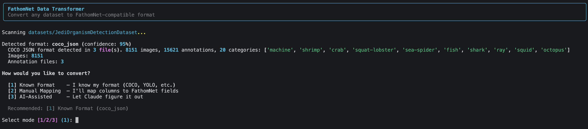
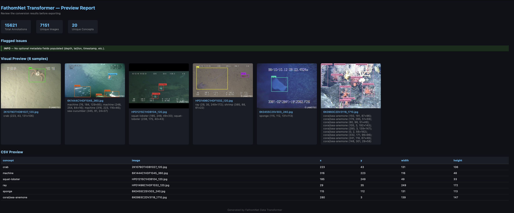
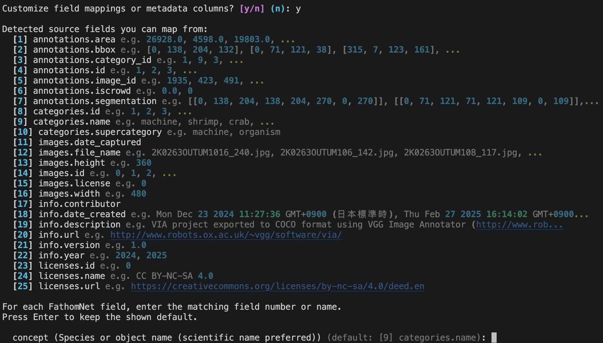

# FathomNet Data Transformer

This repository contains a Python command line tool for converting common image
annotation datasets into a FathomNet-style `metadata.csv` plus the image files
needed for review or submission.

This tool is for MBARI researchers and collaborators who have annotated
ocean imagery in formats such as COCO, YOLO, Pascal VOC, FishCLEF video/XML, or
folder-encoded image collections, and who need a cleaner FathomNet-compatible
CSV without hand-editing every annotation.

This is a working research utility, not a polished product. It can save a lot
of time, but you should still review the generated CSV, preview report, and
dropped-item list before submitting anything.

## What It Does

The transformer:

- Detects the input dataset format from files and directory structure, and
  reports a confidence score.
- Converts annotations into FathomNet-style rows with `concept`, `image`, `x`,
  `y`, `width`, and `height`.
- Copies referenced local images into the output folder. When two source images
  have the same filename, the second copy is automatically renamed (e.g.,
  `img_1.jpg`) and the CSV is updated to match.
- Searches common image subdirectories (`images/`, `imgs/`, `photos/`,
  `JPEGImages/`) and one level deeper automatically, so pointing the tool at
  an annotations-only folder usually still finds images.
- Optionally converts unsupported local image formats to `.png` or `.jpg` for
  NOAA-NCEI-oriented submissions.
- Validates common output problems, including missing required fields, invalid
  boxes, duplicate annotations, unsupported NOAA image formats, and missing
  local images.
- Generates a terminal preview and an HTML review report with sample bounding
  boxes drawn on a statistically diverse set of records (most common class,
  rarest class, busiest image, smallest and largest bounding boxes, diverse
  concepts).
- Tracks dropped or unavailable annotations/images so you can see what did not
  make it into the final CSV.

The tool does not upload data to FathomNet or NOAA NCEI. Known and manual modes
write local files only. AI mode sends a sampled view of the dataset to the
Claude API so it can suggest a mapping.


*Figure 1. CLI screenshot.*



*Figure 2. Preview report.*## Quick Start

Requires Python 3.9 or newer.

From the repository root:

```bash
python3 -m venv .venv
source .venv/bin/activate
pip install -r requirements.txt
```

Run the interactive workflow:

```bash
python3 cli.py
```

Or convert a known dataset directly:

```bash
python3 cli.py /path/to/dataset --mode known --format coco_json
```

After you approve the run, output is written next to `cli.py` by default:

```text
fathomnet_output/
  metadata.csv
  copied_or_extracted_images.jpg
  copied_or_extracted_images.png

fathomnet_output_review/
  preview.html
  previews/
```

For NOAA-NCEI-style packaging, manually zip the contents of
`fathomnet_output/` after review. Do not include `fathomnet_output_review/` in
the submission package.

### API key setup

AI mode requires an Anthropic API key. You can set it in your shell:

```bash
export ANTHROPIC_API_KEY=sk-ant-your-key
```

Or create a `.env` file in the repository root (automatically loaded if
`python-dotenv` is installed, which it is via `requirements.txt`):

```text
ANTHROPIC_API_KEY=sk-ant-your-key
```

## Command Examples

Auto-detect a dataset and use the recommended known converter:

```bash
python3 cli.py /path/to/dataset --mode known
```

Write output to a specific folder:

```bash
python3 cli.py /path/to/dataset --mode known --format yolo -o /path/to/output_folder
```

Generate files without opening the HTML preview automatically:

```bash
python3 cli.py /path/to/dataset --mode known --format pascal_voc --no-preview
```

Convert local `.bmp`, `.tif`, `.tiff`, or `.webp` source images to PNG for a
NOAA-NCEI-oriented output package:

```bash
python3 cli.py /path/to/dataset --mode known --format coco_json --convert-images png
```

Use self-hosted rules, where image URLs are allowed in the CSV:

```bash
python3 cli.py /path/to/dataset --mode known --format coco_json --submission-target self-hosted
```

Run AI-assisted analysis for an ambiguous dataset:

```bash
export ANTHROPIC_API_KEY=sk-ant-your-key
python3 cli.py /path/to/dataset --mode ai --prompt "Short description of the dataset"
```

AI mode samples local files and sends that sample to the Anthropic API. It does
not create new converter code; it can only use the converters that already
exist in this repository.

Convert a folder-encoded dataset where the images are already pre-cropped to
their bounding boxes (the bounding box in the CSV will cover the whole image,
and the original crop position is preserved as `source_x`/`source_y` columns):

```bash
python3 cli.py /path/to/dataset --mode known --format folder_encoded --crops
```

Use a custom folder-encoded filename bbox order:

```bash
python3 cli.py /path/to/dataset --mode known --format folder_encoded --bbox-order x,y,width,height
```

## Supported Input Formats

The built-in converter names are:

| Format | CLI value | Converter |
| --- | --- | --- |
| COCO JSON | `coco_json` | `converters/coco.py` |
| YOLO text labels | `yolo` | `converters/yolo.py` |
| Pascal VOC XML | `pascal_voc` | `converters/pascal_voc.py` |
| FishCLEF XML/video | `fishclef_xml` | `converters/fishclef.py` |
| Folder-encoded datasets | `folder_encoded` | `converters/folder_encoded.py` |

The detector can also notice CSV-like files, but there is not yet a generic CSV
converter. See Known Limitations.

### COCO JSON

Expected content:

- A JSON file with top-level `images`, `annotations`, and `categories` arrays.
- COCO bounding boxes in `[x, y, width, height]` pixel format.
- Image filenames in the COCO `images[].file_name` field.

Common folder structure:

```text
dataset/
  coco.json
  images/
    image_001.jpg
    image_002.png
```

Command:

```bash
python3 cli.py dataset --mode known --format coco_json
```

The converter preserves COCO annotation `score` when present and maps `iscrowd`
to `groupof`.

### YOLO

Expected content:

- One `.txt` label file per image.
- Each annotation line must be:

```text
class_id center_x center_y width height
```

- Coordinates must be normalized from 0 to 1.
- A class-name file is optional but strongly recommended. The detector looks
  for `classes.txt`, `names.txt`, or `obj.names`.

Common folder structure:

```text
dataset/
  classes.txt
  images/
    train/
      image_001.jpg
  labels/
    train/
      image_001.txt
```

Command:

```bash
python3 cli.py dataset --mode known --format yolo
```

If no class-name file is found, concepts are written as `class_0`, `class_1`,
and so on.

### Pascal VOC XML

Expected content:

- XML files with `<annotation>` as the root element.
- Each object should contain `<name>` and `<bndbox>`.
- Bounding boxes use `xmin`, `ymin`, `xmax`, `ymax` and are converted to
  FathomNet-style `x`, `y`, `width`, `height`.

Common folder structure:

```text
dataset/
  Annotations/
    image_001.xml
  JPEGImages/
    image_001.jpg
```

Command:

```bash
python3 cli.py dataset --mode known --format pascal_voc
```

The converter also carries VOC `truncated`, `occluded`, and `difficult` values
when they are present.

### FishCLEF XML/Video

Expected content:

- A video directory named `videos/` or `video/`.
- An XML annotation directory named `gt/`, `annotations/`, `xml/`, or `labels/`.
- XML files with a `<video>` root and `<frame>` / `<object>` elements.
- Object attributes for concept and bounding box values. The default concept
  attributes searched are `fish_species`, `species_name`, `name`, `label`, and
  `class`; the default box attributes are `x`, `y`, `w`, and `h`.

Common folder structure:

```text
dataset/
  videos/
    dive_001.mp4
  gt/
    dive_001.xml
```

Command:

```bash
python3 cli.py dataset --mode known --format fishclef_xml
```

The converter extracts annotated video frames into the output folder as `.jpg`
files and adds `video_name` and `frame_number` columns to the CSV. Video support
requires OpenCV from `opencv-python`; FLV files may require `ffmpeg` if OpenCV
cannot read them directly.

### Folder-Encoded Datasets

Expected content:

- Images grouped in concept-named folders.
- Bounding boxes encoded in filenames.

Supported filename patterns include:

```text
87x38+856+944
image_856_944_87_38.jpg
```

For the first pattern, the order is `width x height + x + y`. For the second
pattern, the order is `x_y_width_height`.

Common folder structure:

```text
dataset/
  Sebastes_rosaceus/
    sample_87x38+856+944.jpg
  Chionoecetes_tanneri/
    sample_214_120_64_51.png
```

Command:

```bash
python3 cli.py dataset --mode known --format folder_encoded
```

Images without a recognized bounding box pattern are dropped and listed in the
review report.

#### Custom filename bbox order

If a folder-encoded dataset uses the same four-number filename style but in a
different order, pass `--bbox-order` with each value exactly once:

```bash
python3 cli.py dataset --mode known --format folder_encoded --bbox-order width,height,x,y
python3 cli.py dataset --mode known --format folder_encoded --bbox-order x,y,width,height
```

If the filename needs a different regex entirely, pass `--bbox-pattern` plus the
matching capture-group order. The regex must contain four capture groups for the
four bbox values:

```bash
python3 cli.py dataset --mode known --format folder_encoded \
  --bbox-pattern 'box-(\d+)-(\d+)-(\d+)-(\d+)' \
  --bbox-order x,y,width,height
```

The short names `w` and `h` are accepted in `--bbox-order`.

#### Pre-cropped images: the `--crops` flag

Folder-encoded datasets come in two flavors:

- **Full frames** — each image is the full frame, and the filename coordinates
  describe a bounding box region within that frame. This is the default
  behavior.
- **Pre-cropped images** — each image has already been cropped to the bounding
  box region (the image dimensions equal the box dimensions). The filename
  coordinates describe where the crop was taken from in the original full
  frame, which may no longer be available.

For the second case, pass `--crops`:

```bash
python3 cli.py dataset --mode known --format folder_encoded --crops
```

With `--crops`:

- The submission bounding box is set to `(x=0, y=0, width=image_width,
  height=image_height)` so it covers the whole cropped image. This is what
  FathomNet expects when you submit pre-cropped imagery.
- The original crop position from the filename is preserved in two extra CSV
  columns: `source_x` and `source_y`. This keeps the provenance metadata even
  though the original full frames are not part of the submission.

If you forget `--crops` on a pre-cropped dataset, the bounding boxes will be
written to the CSV but they will draw outside the image area in the preview
(because the coordinates point to a region in a full frame that does not
exist), so the boxes will be invisible.

## Output Format

The main output is `metadata.csv`. Required columns are:

| Column | Meaning |
| --- | --- |
| `concept` | Species or object name. Scientific names are preferred. |
| `image` | Local image filename for NOAA-NCEI-style output, or URL for self-hosted output. |
| `x` | Bounding box top-left x coordinate in pixels. |
| `y` | Bounding box top-left y coordinate in pixels. |
| `width` | Bounding box width in pixels. |
| `height` | Bounding box height in pixels. |

Optional columns supported by the internal record model are:

```text
depth, altitude, latitude, longitude, temperature, salinity, oxygen, pressure,
observer, timestamp, imagingtype, occluded, truncated, userdefinedkey,
altconcept, groupof
```

Converters may also add extra useful columns. For example, FishCLEF output adds
`video_name` and `frame_number`; COCO may add `score`.

### Image count vs. detected image count

The detector reports the total number of images listed in the source dataset
(for example, all entries in a COCO `images` array). The output CSV only
contains rows for **annotated** images — images that have at least one
bounding box. Images listed in the dataset but with no annotations are not
written to the CSV because there is nothing to submit.

This means the unique image count in `metadata.csv` will often be lower than
the count shown during detection. For the Jedi dataset, for example, 8151
images were detected but only 7151 appear in the output because 1000 images
had no annotations across the train, test, and validation splits. This is
expected behavior, not a bug.

If you need unannotated images included (for example, to flag confirmed-empty
frames), the relevant converter would need to be modified to emit a placeholder
row for images with no annotations.

For `--submission-target noaa-ncei`, which is the default:

- CSV `image` values must be local filenames, not URLs.
- Final image files must be `.jpg` or `.png`. (See the FathomNet article
  ["No Hosting, No Problem"](https://www.fathomnet.org/post/no-hosting-no-problem-how-to-submit-to-fathomnet-database-using-noaa-ncei-s-data-hosting-infrastru)
  for the exact submission requirements.)
- `.jpeg` files are automatically renamed to `.jpg` during the copy step
  because the bytes are identical to a `.jpg` — NOAA-NCEI just doesn't accept
  the `.jpeg` extension. The CLI prints a one-time notice the first time this
  happens and reports the total renamed count when conversion finishes. The
  source files on disk are not modified; only the copies in the output folder
  use the `.jpg` extension.
- Other unsupported local image extensions (`.tif`, `.tiff`, `.bmp`, `.webp`)
  are rejected unless you use `--convert-images png` or `--convert-images jpg`.

For `--submission-target self-hosted`:

- URL image values are allowed.
- URL images are not downloaded or copied by this tool.

## Image Conversion

Use image conversion when your local source images are valid scientific images
but have an extension not accepted by the target package, such as `.tif`,
`.tiff`, `.bmp`, or `.webp`.

```bash
python3 cli.py dataset --mode known --format coco_json --convert-images png
```

Conversion is performed with Pillow after the annotation conversion step. The
tool verifies that the converted image dimensions match the original dimensions.
For JPEG output, transparent images are flattened onto a white background.

For scientific credibility, keep the original files as source data. The
converted PNG/JPG files are derivative submission copies. PNG is usually safer
when you want lossless pixel values; JPEG creates smaller files but uses lossy
compression.

## Fuzzy Field Matching

When the tool prompts you to map source fields to FathomNet fields (in both
known-format field override mode and manual mode), it uses a three-tier
matching strategy to suggest candidates automatically:

1. **Exact match** — field names that match after normalizing case, underscores,
   and hyphens. Auto-accepted and pre-filled.
2. **Known alias** — a built-in dictionary of common synonyms, such as `class`,
   `label`, `species`, `taxon` → `concept`; `filename`, `file_name`, `url`,
   `img_path` → `image`; `xmin`, `left`, `x1` → `x`; `lat` → `latitude`;
   `lon`/`lng` → `longitude`; and so on. Auto-accepted with a note.
3. **Fuzzy similarity** — sequence similarity after abbreviation expansion
   (e.g., `img` → `image`, `bbox` → `boundingbox`). Suggestions above 40%
   similarity are shown; the user can accept or override.

You do not need to know the exact FathomNet field names in advance — the tool
makes its best guess and lets you correct it.

## Known-Format Interactive Prompts

When running known-format mode, the CLI offers two optional customizations
before conversion begins:

**Prerequisite check.** Each converter validates that the dataset has the
expected structure (for example, a YOLO dataset should have matching label and
image files). Warnings are shown if anything looks off, and you can choose to
proceed or stop.

**Field override.** After detecting fields, the CLI asks:

```
Customize field mappings or metadata columns? [y/N]
```

If you answer `y`, the CLI prints a numbered source-field reference with sample
values. When prompted for each FathomNet field, enter either the source field
number or the source path. For example, if `categories.name` is shown as `[17]`,
you can enter `17` for `concept`; if `images.file_name` is shown as `[21]`, you
can enter `21` for `image`. Prompts show the converter's current default mapping
inline, and pressing Enter keeps that default. The CLI can then also prompt for
optional fields such as `timestamp`, `latitude`, `longitude`, `observer`, and
`userdefinedkey`. This is useful when your dataset uses non-standard field names
that the built-in converter does not expect (for example, a COCO JSON that
stores category names in `label` instead of `name`). For COCO metadata, use paths such as
`images.uuid`, `images.date_captured`, `images.gps_lat_captured`,
`images.gps_lon_captured`, or `annotations.id`.

After the FathomNet field prompts, known-format mode can also show other
detected source fields, sample values, and let you include them as extra CSV
columns. This works for all built-in converters. COCO exposes paths such as
`images.*`, `annotations.*`, `categories.*`, row-specific `licenses.*`, and
`info.*`; Pascal VOC and FishCLEF expose XML paths such as `object.name` or
`frame.id`; YOLO exposes generated paths such as `annotation.class_id`,
`class.name`, and `image.width`; folder-encoded datasets expose paths such as
`folder.name`, `image.relative_path`, and `filename.x`. For example, selecting
`images.uuid`, `object.difficult`, or `annotation.class_id` can create extra
columns such as `images_uuid`, `object_difficult`, or `annotation_class_id`.

*Figure 3. Custom Mapping screenshot.*
**Concept exclusion.** The CLI asks:

```
Classes to exclude (comma-separated, or Enter to skip):
```

Any class names entered here are filtered out of the output entirely. The
dropped items appear in the review report.

## Review Workflow

After conversion, the CLI writes temporary staged files, runs validation, shows a
terminal preview, and creates an HTML report. The requested `fathomnet_output/`
folder is not written until you approve the run. The `--no-preview` flag prevents
the report from opening automatically in a browser, including reports regenerated
from the approval loop.

The review folder is intentionally separate:

```text
fathomnet_output_review/
  preview.html
  previews/
```

Review `preview.html` before approving the run. It includes:

- Output counts.
- Validation errors, warnings, and informational notes.
- Sample images with bounding boxes drawn on them.
- A CSV sample.
- Dropped or unavailable items, sometimes with image thumbnails when the source
  image can still be found.

For an additional spot-check after an output folder has already been written,
run the standalone sampler:

```bash
python3 sample_bbox.py /path/to/output_folder
```

It opens a local browser page showing 10 random images from `metadata.csv` with
their bounding boxes drawn. Click **New Random Batch** or press Enter/Space to
load another 10 random images, and click **Quit** or press Ctrl+C in the
terminal when finished.

Useful sampler options include `--n` for batch size, `--metadata` for a custom
CSV path, `--seed` for repeatable samples, `--host` / `--port` for the local
server, and `--no-open` to print the URL without opening a browser.

The sample images shown in the preview are chosen by a **smart sampling
strategy** to give a statistically diverse view: the most common class, the
rarest class, the image with the most bounding boxes, the smallest bounding box,
the largest bounding box, and additional records from different species to fill
out the sample. You can request a fresh random sample from the approval prompt.

### Approval Prompt Options

After the preview is generated, the CLI presents an approval loop:

```
[y] Looks good — export final CSV
[n] Something's wrong — describe the issue
[m] Show more sample images
[c] Show full class distribution
[t] Treat images as pre-cropped/full frames and rerun
[r] Show current mapping config
[q] Quit without exporting
```

- **[y]** Exports the staged CSV/images/review report to the requested output
  folders and exits. The summary shows annotation count,
  unique image count, and unique concept count.
- **[n]** Prompts you to describe the problem in plain text. The tool re-runs
  the AI mapper with your feedback and the full correction history, then
  regenerates the preview. Up to 4 correction attempts are allowed before the
  tool suggests editing the mapping manually.
- **[m]** Draws a fresh random sample from all records and regenerates the
  preview report.
- **[c]** Prints a bar chart of the full concept distribution for all records.
- **[t]** Toggles between full-frame boxes and pre-cropped image boxes, reruns
  the current conversion, and regenerates validation and previews.
- **[r]** Prints the current `MappingConfig` as JSON so you can inspect or
  copy it.
- **[q]** Exits without exporting. The temporary staged conversion files are
  discarded.

## Manual And Custom Mapping

Manual mode prompts you to map detected source fields to FathomNet fields:

```bash
python3 cli.py dataset --mode manual
```

This is most useful when the dataset is a known format with slightly different
field names. For example, a COCO-like JSON might use a different category name
field, or a Pascal VOC-like XML might use a different object label tag.

During manual mapping you are prompted for:

- Each **required field** (`concept`, `image`, `x`, `y`, `width`, `height`),
  with fuzzy-matched suggestions pre-filled.
- Each **optional field** (`depth`, `latitude`, `longitude`, `temperature`,
  `salinity`, `oxygen`, `pressure`, `observer`, `timestamp`, `imagingtype`,
  `occluded`, `truncated`, `userdefinedkey`, `altconcept`, `groupof`). Press
  Enter to skip any optional field.
- The **coordinate format** of bounding boxes:
  - `xywh` — top-left x, top-left y, width, height (default)
  - `xyxy` — top-left x, top-left y, bottom-right x, bottom-right y
  - `cxcywh` — center x, center y, width, height (normalized 0–1)
  - `cxcywh_abs` — center x, center y, width, height (absolute pixels)
- **Classes to exclude** (comma-separated list, or Enter to skip).

Manual mode currently still needs a built-in converter. If the detector finds a
CSV file or an unknown format, the CLI can show field names, but the generic CSV
converter is not implemented yet.

### MappingConfig: Aliases, Offsets, and Serialization

The `MappingConfig` class supports several transforms applied by the engine
regardless of which mode produced the config:

- **Concept aliases** — rename source class labels to FathomNet concept names.
  For example, `{"DR": "Dascyllus reticulatus"}` renames every `DR` annotation
  to the full scientific name in the output CSV.
- **Concept exclusions** — drop entire classes from the output.
- **Coordinate offsets** — apply a fixed pixel offset to all `x` and `y`
  values. Useful when a source dataset uses a different image crop origin.
  Example: `x_offset = -10, y_offset = -10`.

A `MappingConfig` can be saved and loaded for reproducibility:

```python
from mapper.mapping_config import MappingConfig

# Save to YAML
config.save("my_mapping.yaml")

# Load from YAML
config = MappingConfig.load("my_mapping.yaml")

# Inspect as JSON
print(config.to_json())
```

Known and manual modes can load a saved YAML config with `--mapping`:

```bash
python3 cli.py dataset --mode known --mapping my_mapping.yaml
python3 cli.py dataset --mode manual --mapping my_mapping.yaml
```

## Validation Checks

The validator checks for:

- Empty output.
- Missing required fields.
- Unknown or empty concepts.
- Datasets with only one concept, which may or may not be intentional.
- Zero-area or negative bounding boxes.
- Negative coordinates.
- Very small bounding boxes (< 5×5 pixels).
- Identical coordinates across all records.
- Duplicate annotations.
- NOAA-NCEI image URL and extension rules.
- Referenced local image files missing from the output folder.
- `userdefinedkey` values longer than 56 characters.
- Latitude and longitude values outside valid ranges.

After the checks, the validation summary also reports bounding box area
statistics (minimum, maximum, and mean area in pixels²) and which optional
metadata fields are populated (for example, `depth (142)`, `latitude (142)`).

Validation is a review aid. It does not prove the dataset is scientifically or
taxonomically correct.

## AI-Assisted Mode

AI mode uses the Claude API to analyze a sample of the dataset and propose a
field mapping:

```bash
export ANTHROPIC_API_KEY=sk-ant-your-key
python3 cli.py /path/to/dataset --mode ai --prompt "Fish species dataset from ROV surveys"
```

The tool samples up to 3 annotation files (first 50 lines each), up to 15
image filenames, and the directory tree (3 levels deep, 10 items per level),
then sends this to Claude for analysis.

Claude returns:

- Detected format and confidence score.
- Proposed field mapping with optional transform descriptions.
- Suggested concept exclusions and concept aliases.
- Coordinate format (`xywh`, `xyxy`, etc.).
- Notes on anything unusual about the dataset.
- Questions if anything is ambiguous.

**Answering AI questions.** If Claude has questions about your dataset, you can
answer them at the prompt. The tool makes a second API call with your answers
included, then shows an updated mapping before proceeding.

**AI correction loop.** If the mapping does not look right after you see the
preview, choose `[n]` in the approval prompt and describe the problem. The tool
sends the full correction history (all prior mapping attempts plus your
feedback) to Claude and re-runs. Up to 4 correction attempts are supported.

AI mode does not create new converter code; it selects from the converters
already in this repository. It can use detected fields and `filename_regex:`
extraction, but it will stop rather than silently proceed if Claude proposes
unsupported `computed:` or `constant:` mapping sources.

## Troubleshooting

### "Path not found"

Check that the path passed to `cli.py` exists on this machine. Quote paths that
contain spaces:

```bash
python3 cli.py "/path/with spaces/dataset"
```

### "No records produced"

The converter ran but no annotations survived. Common causes are:

- The wrong `--format` was selected.
- Bounding boxes are missing or malformed.
- Folder-encoded images do not contain a supported bbox filename pattern.
- YOLO label files do not have matching images.
- FishCLEF XML files do not match any video names.
- NOAA-NCEI mode rejected URL images or unsupported image extensions.

Check the dropped/unavailable section in `fathomnet_output_review/preview.html`.

### YOLO classes are `class_0`, `class_1`, etc.

Add a class-name file such as:

```text
dataset/
  classes.txt
```

Each line should contain the concept name for the corresponding numeric class
ID, starting at 0.

### YOLO labels are dropped because images cannot be found

The converter looks for:

- An image beside the label file with the same stem.
- Mirrored `labels/...` to `images/...` paths.
- A sibling `../images/` directory.

If your layout is different, reorganize the dataset or add/copy images into one
of those expected locations before running the tool.

### NOAA-NCEI output rejects image URLs

Use local image files for the default `noaa-ncei` target. If your dataset is
intended to keep externally hosted URLs in the CSV, run:

```bash
python3 cli.py dataset --submission-target self-hosted
```

### NOAA-NCEI output rejects `.tif`, `.bmp`, or `.webp`

Use image conversion:

```bash
python3 cli.py dataset --mode known --format coco_json --convert-images png
```

Keep the original images separately as provenance/source data.

### FishCLEF video conversion is slow or fails

FishCLEF conversion loads videos through OpenCV and extracts frames. Very large
or long videos can take significant memory and time. FLV files may require
`ffmpeg` if OpenCV cannot decode them directly. When that fallback is used, the
video utility writes a transcoded `.mp4` beside the source `.flv`.

### AI mode says no API key was found

Set `ANTHROPIC_API_KEY` in your shell or in a `.env` file in the repository
root:

```bash
export ANTHROPIC_API_KEY=sk-ant-your-key
# — or —
echo "ANTHROPIC_API_KEY=sk-ant-your-key" >> .env
```

Use `--mode known` whenever the detector identifies a supported format; it does
not require an API key.

### The preview report did not open

The report is still written to:

```text
fathomnet_output_review/preview.html
```

Open that file manually in a browser. You can also use `--no-preview` to skip
automatic browser opening.

### Two images from different folders have the same filename

The engine automatically resolves filename collisions. The second image is
renamed (e.g., `fish.jpg` → `fish_1.jpg`) and the corresponding CSV rows are
updated to point to the renamed file. No action is required, but confirm in the
review report that both images were preserved.

## Known Limitations

- Generic CSV conversion is not implemented, even though CSV files can be
  detected.
- Manual mapping does not apply arbitrary computed transforms or defaults from
  `MappingConfig`.
- `coordinate_format` is collected in manual mapping, but most converters do
  not use it. Built-in converters handle their own expected coordinate formats.
- AI-assisted mode requires the Anthropic API and can only choose among existing
  converters. It does not generate new converter code.
- Validation does not check every bounding box against actual image dimensions,
  so boxes extending beyond the image can still pass.
- Negative `x` or `y` values are clamped to 0 by shrinking the box; review those
  cases visually when possible.
- If image copying fails or an image cannot be found, the metadata row may be
  kept and the issue is reported as a dropped/unavailable image item.
- Reusing an existing output folder does not fully clear stale images from
  previous runs. The CLI removes old preview artifacts from the submission
  folder, but not every old image.
- If zero records survive, `metadata.csv` is not written.
- FishCLEF/video conversion can be memory-heavy because videos are loaded for
  frame extraction.
- Folder-encoded conversion is heuristic and drops images without recognized
  filename bounding boxes.
- Taxonomic validity is not checked. Unknown or suspicious concepts are
  warnings, not authoritative taxonomy validation.
- There is no automated test suite in this repository at the moment.

## Developer Architecture

The code is organized around a simple pipeline:

```text
detectors/detect.py
  Scans a dataset path, counts images and annotations, and returns a detected
  format plus supporting details. Also builds a directory tree and file sample
  used by AI mode.

converters/
  One converter per supported source format. Each converter yields
  FathomNetRecord objects from converters/base.py and records items it drops
  via record_drop(). FathomNetRecord carries required fields, all optional
  metadata fields, and an `extra` dict for format-specific columns that are
  preserved in the CSV output.

mapper/
  Builds MappingConfig objects from manual prompts or AI-assisted analysis.
  The engine consumes this config for exclusions, aliases, offsets, and
  selected converter-specific overrides. MappingConfig can be serialized to
  YAML or JSON for reproducibility.

utils/fuzzy_match.py
  Three-tier field-name matching (exact → known alias → similarity score)
  used by manual mode and known-format field overrides.

transform/engine.py
  Runs the converter, applies shared transformations (concept aliases,
  x/y offsets, negative-coordinate clamping), validates individual records,
  copies or converts images (with collision-safe renaming), tracks dropped
  items, and writes staged metadata.csv files.

validate/validator.py
  Runs post-conversion checks against the in-memory output records. Reports
  errors, warnings, and info including bounding box area statistics and which
  optional metadata fields are populated.

preview/
  Produces terminal summaries, image previews with bounding boxes, and the
  HTML review report.

cli.py
  Connects detection, mode selection, conversion, validation, preview, and
  the approval loop. It stages conversion artifacts first and exports them to
  the requested output folders only after approval.
```

The common intermediate record is `FathomNetRecord`. New converters should
yield this record type, report skipped inputs with `record_drop()`, and avoid
writing output files directly unless the source format requires extraction, as
FishCLEF video does for frames.

## Adding New Converters and Detectors

This section explains how to add support for a new source dataset format. The
full process has three steps: write a converter, register it, and optionally
write a detector. The COCO converter (`converters/coco.py`) is the most
complete reference example.

### Step 1 — Write the converter

Create a new file in `converters/`, for example `converters/my_format.py`.
Subclass `BaseConverter` and implement the three methods below.

```python
from pathlib import Path
from typing import Generator, Optional
from .base import BaseConverter, FathomNetRecord


class MyFormatConverter(BaseConverter):
    format_name = "my_format"           # must match the key you add to CONVERTER_REGISTRY
    format_description = "My dataset format"

    def convert(
        self,
        dataset_path: str,
        detection_result: dict,
        field_overrides: Optional[dict] = None,
    ) -> Generator[FathomNetRecord, None, None]:
        """
        Yield one FathomNetRecord per annotation.
        Call self.record_drop(...) for anything that cannot be converted.
        """
        overrides = field_overrides or {}
        dataset_path = Path(dataset_path)

        # --- parse your format here ---
        for raw_ann in my_parse_function(dataset_path):
            concept = raw_ann["label"]
            image_file = raw_ann["filename"]

            if not concept or not image_file:
                self.record_drop(
                    item_type="annotation",
                    reason="Missing concept or image filename",
                    source=str(dataset_path),
                    concept=concept,
                    image=image_file,
                )
                continue

            record = FathomNetRecord(
                concept=concept,
                image=image_file,
                x=int(raw_ann["x"]),
                y=int(raw_ann["y"]),
                width=int(raw_ann["w"]),
                height=int(raw_ann["h"]),
                # source_image_path helps the engine find the image to copy;
                # set it when you know the absolute path to the source image.
                source_image_path=str(dataset_path / image_file),
            )

            # Optional metadata fields — set only what your format provides.
            record.depth = raw_ann.get("depth")
            record.timestamp = raw_ann.get("timestamp")

            # Format-specific extras go in record.extra; they become CSV columns.
            if "confidence" in raw_ann:
                record.extra["confidence"] = raw_ann["confidence"]

            yield record

    def get_field_names(self, dataset_path: str, detection_result: dict) -> list[str]:
        """
        Return the source field names found in this dataset.
        Used by fuzzy matching and the manual mapping UI.
        Return an empty list if your format has no named fields.
        """
        return ["label", "filename", "x", "y", "w", "h"]

    def validate_prerequisites(
        self, dataset_path: str, detection_result: dict
    ) -> list[str]:
        """
        Return a list of error strings if the dataset is missing required
        files or structure. An empty list means ready to convert.
        The CLI shows these as warnings and asks the user to confirm.
        """
        errors = []
        dataset_path = Path(dataset_path)
        if not list(dataset_path.glob("*.myext")):
            errors.append("No .myext annotation files found in the dataset folder.")
        return errors
```

**Key rules:**

- `convert()` must `yield` `FathomNetRecord` objects, not write files directly.
  The engine handles CSV writing and image copying.
- Call `self.record_drop(...)` (not `return` or `raise`) for every annotation
  that cannot be converted. Dropped items appear in the review report.
- Set `record.source_image_path` whenever you know where the source image lives.
  This allows the engine to find and copy the image even when the filename alone
  is ambiguous.
- Put format-specific columns in `record.extra` as a dict. They are flattened
  into additional CSV columns automatically.
- If your format needs to write image files (as FishCLEF does for video frame
  extraction), read the `frame_output_dir` key from `field_overrides` to get
  the correct output directory.

### Step 2 — Register the converter

Open `converters/__init__.py` and add your converter:

```python
from .my_format import MyFormatConverter

CONVERTER_REGISTRY = {
    "coco_json":       COCOConverter,
    "pascal_voc":      PascalVOCConverter,
    "yolo":            YOLOConverter,
    "folder_encoded":  FolderEncodedConverter,
    "fishclef_xml":    FishCLEFConverter,
    "my_format":       MyFormatConverter,   # add this line
}
```

After this, users can run:

```bash
python3 cli.py /path/to/dataset --mode known --format my_format
```

AI mode will also be able to select `my_format` when it recognizes the dataset.

### Step 3 — Write a detector (optional but recommended)

A detector lets the tool auto-identify your format without the user needing to
specify `--format`. Open `detectors/detect.py` and add a `_detect_my_format`
function following the same pattern as the existing ones:

```python
def _detect_my_format(
    path: Path, ann_files: list, img_files: list
) -> Optional[dict]:
    """Detect my format by looking for .myext files with expected content."""
    my_files = [f for f in ann_files if f.suffix.lower() == ".myext"]
    if not my_files:
        return None

    # Optionally open and inspect one file to raise confidence.
    for mf in my_files[:2]:
        try:
            with open(mf, "r") as f:
                first_line = f.readline()
            if "expected_signature" in first_line:
                return {
                    "format": "my_format",
                    "confidence": 0.90,
                    "details": (
                        f"My format detected. {len(my_files)} annotation file(s)."
                    ),
                }
        except OSError:
            continue

    return None
```

Then add a call to your detector inside `detect_format()`, before the final
`unknown` fallback:

```python
result = (
    _detect_coco(dataset_path, annotation_files, image_files)
    or _detect_yolo(dataset_path, annotation_files, image_files)
    or _detect_pascal_voc(dataset_path, annotation_files, image_files)
    or _detect_fishclef(dataset_path, annotation_files, image_files)
    or _detect_folder_encoded(dataset_path, annotation_files, image_files)
    or _detect_my_format(dataset_path, annotation_files, image_files)  # add here
    or _detect_csv(dataset_path, annotation_files, image_files)
)
```

Place more-specific detectors earlier in the chain. The first non-`None` result
wins.

**Detector return value.** The dict must contain at least:

| Key | Type | Meaning |
| --- | --- | --- |
| `format` | str | Must match the key in `CONVERTER_REGISTRY`. |
| `confidence` | float | 0–1. Values above 0.7 trigger a "Known format recommended" hint. |
| `details` | str | Human-readable summary shown in the CLI. |

You can add any extra keys to pass information from detection to the converter
(see how `coco_files` is passed from `_detect_coco` to `COCOConverter`).

### Testing a new converter

There is no formal test suite yet. The recommended manual approach:

1. Run a syntax check:

```bash
python3 -m py_compile converters/my_format.py
```

2. Convert a small representative dataset and check both outputs:

```bash
python3 cli.py /path/to/small_test_dataset --mode known --format my_format --no-preview
```

3. Open `fathomnet_output_review/preview.html` and verify:
   - Annotation counts look right.
   - Bounding boxes are drawn in the correct positions.
   - The dropped-items section shows only genuinely problematic annotations.
   - Concept names look correct.

4. Inspect `fathomnet_output/metadata.csv` directly to confirm column values.
